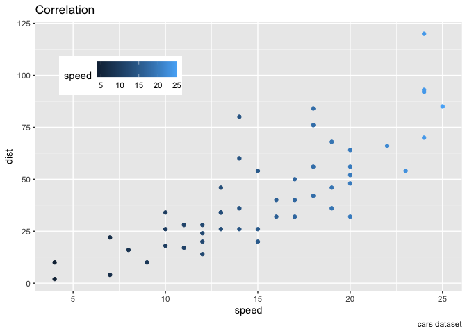

<!-- README.md is generated from README.Rmd. Please edit that file -->

# ggquiet

<!-- badges: start -->

<!-- badges: end -->

The goal of ggquiet is to be able to reveal components of a fully built
up plot. The strategy is to set elements to fully transparent, and then
‘turn on’ the element by changing the transparency to opaque.

“Quiet” refers to two things. If you simply build up a ggplot you will
get “noisiness” in that the plot space will bounce around to adjust for
title positions, axis positions and legend positions (oops\! I haven’t
though about how to work on this part - legends - ugh I’m not sure we
can get it done. hmmm hmm hmm). By having the elements there but fully
transparent (they are also “quiet”), we won’t get the shifting around of
the plot space as we “add” them.

## Installation

You can install the released version of ggquiet from
[CRAN](https://CRAN.R-project.org) with:

``` r
install.packages("ggquiet")
```

And the development version from [GitHub](https://github.com/) with:

``` r
# install.packages("devtools")
devtools::install_github("EvaMaeRey/ggquiet")
```

## Example

This is a basic example which shows you how to solve a common problem:

``` r
library(ggplot2)
#> Warning: package 'ggplot2' was built under R version 3.6.2
library(ggquiet)
## basic example code

ggplot(data = cars) +
  aes(x = speed) +
  aes(y = dist) +
  geom_point()
```



``` r

last_plot() +
  theme_quiet()
```


